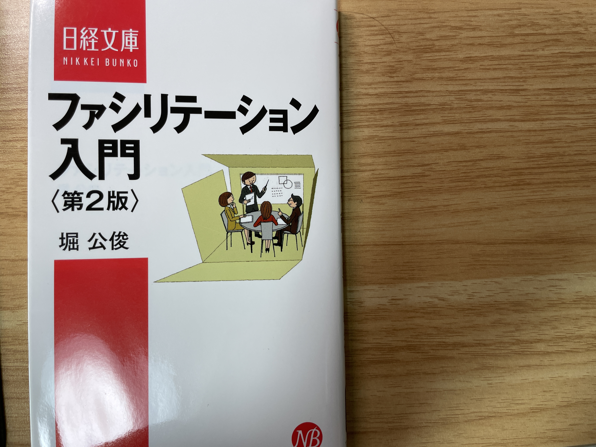

ファシリテーションについて、学ぼうと思い『[ファシリテーション入門](https://amzn.to/3Ui2mcL)』を手に取りました。

気になった箇所のメモを残します。

## なぜファシリテーターが必要なのか
第1章では、そもそもなぜ会議にファシリテーターが必要で、どのような効果を求めるべきなのか、が具体的に記載してあります。

良いファシリテーションだと、下記３つの効果がもたらされます。
- メンバーの相乗効果を発揮し、高い成果が生み出せる
- 活動への納得感を高めることにより、メンバーの自立性を育み、人と組織を活性化する
- 成果に達成するまでの時間が短縮できる

## ファシリテーターに求められる技術
ファシリテーションには下記4つのスキルが必要。
- 【共有】場のデザインのスキル
    - 場を作り、つなげる
- 【発散】対人関係のスキル
    - 受け止め、引き出す
- 【収束】構造化のスキル
    - かみ合わせ、整理する
- 【決定】合意形成のスキル
    - まとめて、分かち合う

自分は【共有】と【発散】のスキルが足りないのではないかと思った。  
【収束】と【決定】はやっていそう。

## それぞれのスキルを深掘り
第3章〜6章では、上記4つのスキルを深掘りして説明している。
自分が弱みとして持っているスキルの章を読んでいくのが良さそう。

私の場合は【共有】と【発散】のスキルが足りないので、第3章と4章を熟読必要があります。

## 場を作り、つなげるとは？
場をデザインするためには、下記5つの要素があります。
- 狙い（目的）
    - なんのために議論するのか、なんのために集まったのか、など話し合いの意味を決める
- ゴール（目標）
    - 「具体策を決める」「目標を合意する」「戦略を策定する」などの目指すべき目標を決める。言い換えると、「会議の終了条件」となる
    - 時間のゴール（2時間、15時までなど）も決める
- プロセス（手順）
    - 目標に向けて具体的に何をすれば良いのか、ゴールまでの道筋を示す
- ルール（行動規範）
    - 必ず発言する、資料は事前に共有する、など、会議のルールを決める
- メンバー
    - 会議の参加者を決める

### プロセス設計が難しい

そして、会議の一番最初にこちらの要素をメンバーに説明するのがファシリテーターの義務となります。
なお、上記5つの中で一番難しいのが「プロセス」とのことで、本の中ではプロセスを設計する7つのパターンを紹介しています。具体的な紹介は割愛しますが、興味ある方はP70をご確認ください。
私のチームの場合は、miroを利用して下記のような流れで対応することが多いです。
1. 付箋で意見を発散
2. 同じような意見をまとめる
3. 意見について議論
4. issue化する

### 話しやすい場を作ることも大切
- メンバーの数と組み合わせを考える
    - メンバーが多い場合は、隣の３名と一旦話してもらうなど、意見を出しやすい環境を作る
- そもそもの空間をデザインする
    - 会議室は話しやすいレイアウトにする、ホワイトボードを利用する、お菓子を用意する、など
- 最初に場を和ませる
    - アイスブレイクやクイズを実施する

### ファシリテーターを信頼してもらう
誠実な対応をし、メンバーから信頼を得るようにする
- 能力への信頼
- 意図への信頼

## 受け止め、引き出すとは
- 「聴く力」を身につける
    - 相手が何を伝えようとしているのか、聴くことに集中する
    - [LISTEN――知性豊かで創造力がある人になれる](https://amzn.to/3Vo7eOG)も併せて読んでおくと良さそう
- 「応える力」を身につける
    - 発言に対してリアクションをする
    - 相槌、アイコンタクト、身を乗り出す、など
    - 時には要約し、相手の発言をまとめる
    - リアクションでめちゃめちゃモチベーションが上がるんだぜ！
- 「観る力」を身につける
    - 言語化されないとことに、相手の意思がある
    - 口調、表情、態度など
    - 特には意見を求め、本音を引き出すことも大事
- 「オープンクエスチョン」と「クローズドクエスチョン」を使い分ける

## 噛み合わせ、整理するとは
誰もが認める道筋を作ってあげる必要がある。

### 論理の三点セット
- 論点
    - 今話すべき論点に焦点を当てる
- 根拠
    - 客観的な理由をあげる
    - 複数の違った根拠を、もれなく出す
- 主張
    - 言いたいことを明確に表現する
    - 曖昧な表現を使わない

### 議論を見えるかして整理する
- 意見をグループに分ける
- 優先順位をつける

## まとめて、分かち合う
### どうすれば納得感のある決定に持っていけるか
- フレームワークを利用する
    - 議論の結果を、フレームワークに落とし込むことにより数値などで見えるか化する。その結果、一番良いものを選ぶ
- 多数決
    - 決定するというよりは、選択肢を絞るために利用する
### 協調的に対立を解消する
- 人の意見は変わらないという前提を持つ(めっちゃ大事)
- 意見は対立するという前提と、それでも尊重し会おうよということを丁寧に伝えていく
- 妥協案を出すのはNG
### 成果を分かち合う
- 合意形成を議事録にまとめる
- 議事録をシェアする
- 振り返りは必ずやる
    - 振り返りは進め方やチームワークを振り返るのであって、コンテンツ（議論内容）を振り返ってはいけない

## まとめ
私は結論を早く出して次に進みたいタイプなので、人の話をしっかりと『聴く』ということが苦手なのかもしれないな、と思った。
話している人が、なんとなく蛇足で喋ってそうだな、と思ったら興味なさそうなふりをして、次の話題に切り替えたがる癖がある。もう少し人の話を聴くことに重きを置いていこうと思う。

テクニックとして学べるところはこの箇所から学び、あとは実践でトライアンドエラーを繰り返して自分なりのファシリテーション力を身につけていく必要がある。

## 参考
- [COPILOT リモートワークにおけるファシリテーションの方法論を公開します！](https://blog.copilot.jp/entry/remote-facilitation)