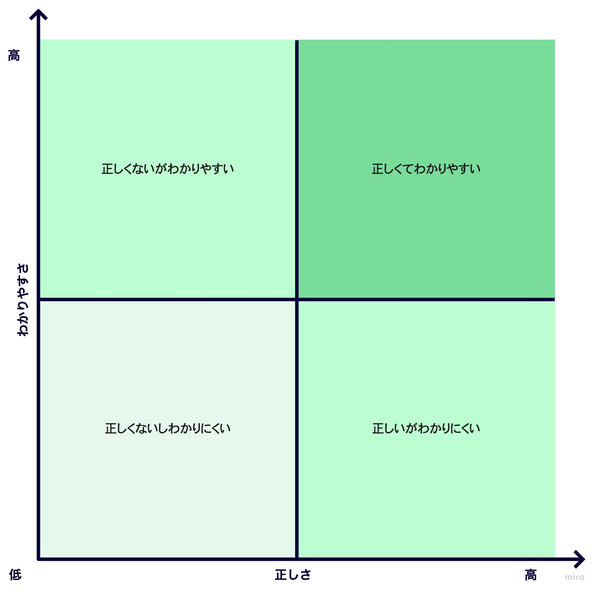

ドキュメントを書くときに重要にしていることは下記2点。

- 正しいことを書く
- わかりやすく書く

シンプルだけどこれに尽きる。

簡単にマトリクスにすると下記イメージ。


ドキュメントを書く時は、赤丸内でなくてはいけない。


そんなの当たり前だ、と思うかもしれないが、実はこれが難しい。
特に、意識して書かないと、「正しいがわかりにくい」を書きがちになってしまう。

それぞれ簡単に説明します。

## 正しいがわかりにくい

正しい情報を提供しているので良いと言えば良いのだが、読み手側に努力を強いる必要があるので避けたいところ。

ちょっと例としてあげるの申し訳ないですが、先日こんなチラシをもらいました。


ぱっとこのチラシを見たときに、「お、このチラシ持っていけばリフト券をプレゼントしてもらえるのか！お得〜!」と思ってしまった。
が、よく見るとこう書いてある。

```
このチラシを持って行こう!!
リフト引換券で
リフト1日券を
プレゼント
```

ポイントは「**リフト引換券で**」の箇所。
つまり、このチラシとリフト引換券を持っていれば、リフト１日券をプレゼント ということらしい。

よく読むと上記が読み取れるのだが、パッと見でリフト１日券をプレゼントしてもらえると勘違いしてしまう。
結構がっかりしている人いるのではないかな、という予想。

## 正しくないがわかりやすい

正しくないことは書いてはいけないのは当然だが、意図せず書いてしまうことがある。
例えば下記。


「みんな大好き」がひっかかる。こんなツッコミが予想される。


主語を「みんな」「だれでも」にする際には正しさに注意。

## 正しくないしわかりにくい

最後、正しくないしわかりにくい。

ちょっと無理矢理感ありますが、下記。


ざっと見ただけで下記のような疑問が浮かぶ。

- 営業時間は何時なのか
- いつまでやっているのか(日付が謎)
- 何時まで問い合わせ可能なのか
- 問い合わせ方法はメール？電話？

## 正しくてわかりやすい
ということで、正しくてわかりやすい文章を書くように心がけよう。


今年も大変お世話になりました。  
12/29(木)〜1/5(木)までお休みします。  
お休み中に連絡いただいた場合、1/6(金)以降にお返事します。  
みなさんも年末年始はゆっくりお過ごしください。良いお年を。